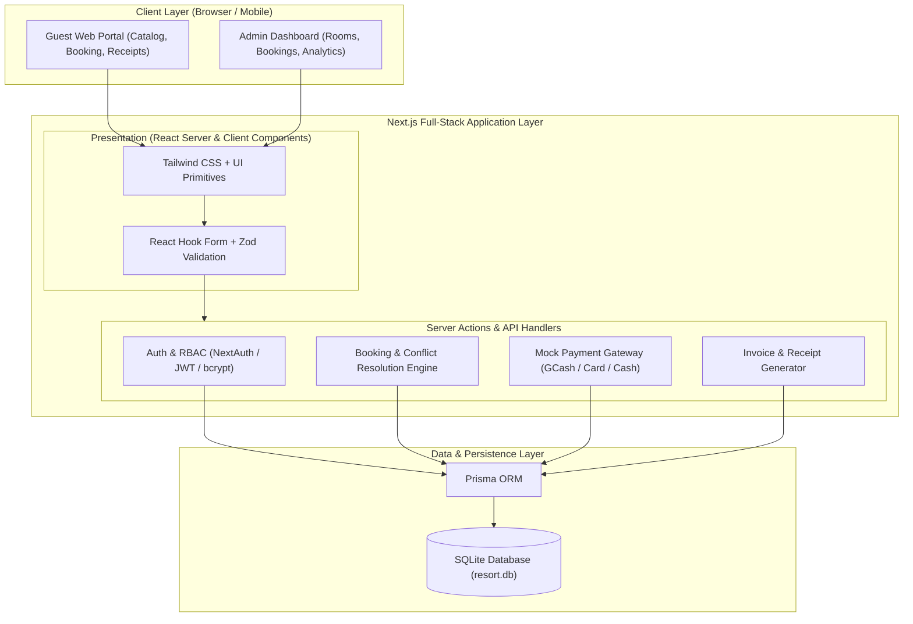
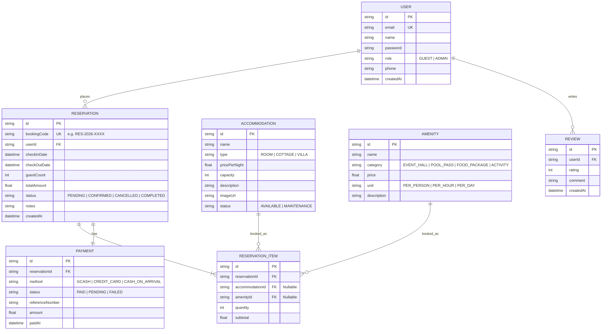
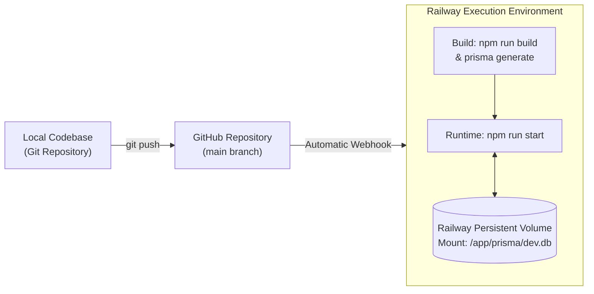

# Resort Reservation Platform — Project Specification & Agent Guide

> **Project Type**: Academic / School Project  
> **Core Objective**: Develop a comprehensive, user-friendly, and responsive web platform for reserving resort rooms, cottages, and amenities with guest management, admin controls, and mock payment workflows.  
> **Database Philosophy**: Lightweight, file-based **SQLite** as the primary storage engine.

---

## 1. System Architecture Overview

The platform uses a modern **Full-Stack Architecture** powered by **Next.js (App Router)**. This brings the frontend and backend into a single cohesive TypeScript codebase, eliminating CORS issues and synchronizing data models between UI and server.



### Architectural Highlights:
- **Server Actions & Route Handlers**: Secure server-side execution for transactions, password hashing, and booking collision validation.
- **Role-Based Access Control (RBAC)**: Distinguishes between `GUEST` (regular customers) and `ADMIN` / `STAFF` (system administrators).
- **Double-Booking Prevention**: Server-side transactional date collision checks ensuring no room/cottage is double-booked for overlapping date ranges.

---

## 2. Complete Technology Stack

| Category | Technology / Tool | Purpose & Justification |
| :--- | :--- | :--- |
| **Framework** | **Next.js 14/15 (App Router)** | Full-stack React framework; handles routing, SSR, API routes, and Server Actions in a single codebase. |
| **Language** | **TypeScript** | End-to-end type safety between database schemas, server actions, and frontend UI components. |
| **Styling & UI** | **Tailwind CSS + Lucide React** | Rapid, modern, mobile-friendly design system with responsive layouts and iconography. |
| **UI Primitives** | **Radix UI / Shadcn UI patterns** | Accessible modals, calendar date-pickers, dropdown menus, and tabs. |
| **Database** | **SQLite (`better-sqlite3` or standard file)** | Lightweight, zero-configuration relational database ideal for school projects and demos. |
| **ORM / Query Engine**| **Prisma ORM** | Type-safe queries, automated schema migrations (`prisma migrate`), and visual database inspection (`prisma studio`). |
| **Authentication** | **NextAuth.js (Auth.js) / Jose & bcryptjs** | Secure credential authentication, session tokens, and route protection middleware. |
| **Validation** | **Zod + React Hook Form** | Schema validation for user inputs (reservation dates, guest counts, contact details). |
| **Date Management** | **date-fns** | Easy date arithmetic, overlap checking, and calendar formatting. |
| **Receipt / Invoice** | **Printable CSS / `@react-pdf/renderer`** | Clean, printable invoices and receipts with booking QR/Reference codes. |

---

## 3. Database Schema (SQLite via Prisma)



---

## 4. Feature Breakdown & Scope

### 4.1 Guest Facing Features
1. **Interactive Showcase & Catalog**:
   - Filter accommodations by type (Room, Villa, Cottage), capacity, and price range.
   - High-resolution photo galleries and amenity breakdowns.
2. **Real-Time Booking & Date Checker**:
   - Dynamic date-range picker with disabled unavailable dates.
   - Add-on amenities selector (pool passes, event hall rentals, catering packages).
3. **Mock Payment Flow**:
   - Simulated payment modal for **GCash** (mock reference number generator), **Credit/Debit Card** (mock validation), or **Cash upon Check-in**.
4. **Digital Receipt & Invoice**:
   - Detailed booking summary with unique `Reference Number` (e.g., `RES-83921`).
   - One-click print or PDF download for check-in verification.
5. **Guest Portal / My Reservations**:
   - View reservation history, current booking statuses, and cancellation options.

### 4.2 Admin & Staff Dashboard
1. **Dashboard Analytics & KPIs**:
   - Total reservations, revenue summary, room occupancy rate, and pending booking approvals.
2. **Reservation Management**:
   - List and filter bookings by date, guest name, status (`Pending`, `Confirmed`, `Checked-In`, `Completed`, `Cancelled`).
   - One-click status updates and manual reservation overrides.
3. **Accommodation & Amenity Management**:
   - CRUD operations (Create, Read, Update, Delete) for rooms, cottages, pricing, and availability states.
4. **Calendar / Schedule View**:
   - Monthly / weekly occupancy calendar displaying upcoming arrivals and departures.

---

## 5. Deployment Architecture & Hosting Strategy

Because the project utilizes **SQLite**, deploying through **GitHub + Railway** is the optimal choice:
- **GitHub**: Source code repository and automatic webhook triggers for continuous deployment.
- **Railway**: Runs a persistent Node.js service (or Docker container) and supports **Persistent Volumes** so your SQLite file (`dev.db` / `resort.db`) is never lost between redeploys.



### GitHub + Railway Setup Guide

1. **GitHub Repository**:
   - Initialize git, commit code, and push to your GitHub repository:
     ```bash
     git add .
     git commit -m "feat: complete resort reservation platform"
     git push origin main
     ```

2. **Railway Project Setup**:
   - Go to [Railway.app](https://railway.app) and click **"New Project"**.
   - Select **"Deploy from GitHub repo"** and choose your repository.

3. **Persistent Volume for SQLite (Crucial)**:
   - In your Railway service settings, navigate to **Volumes**.
   - Add a volume and set the mount path to `/app/prisma` (or mount directory containing `dev.db`).
   - This ensures your SQLite reservations and database data persist across redeployments!

4. **Environment Variables**:
   - In Railway **Variables**, set:
     - `DATABASE_URL` = `file:./dev.db`
       > Prisma resolves **relative SQLite paths against the folder that contains
       > `schema.prisma`** (i.e. `prisma/`), so `file:./dev.db` already points at
       > `prisma/dev.db`. Writing `file:./prisma/dev.db` would resolve to
       > `prisma/prisma/dev.db` and silently create an empty second database.
     - `SESSION_SECRET` = *(a random string of at least 16 characters — used to
       sign the `resort_admin_token` session cookie; the app refuses to start in
       production without it.)*
     - `PORT` = `3000`
     - `NODE_ENV` = `production`

5. **Build & Start Commands** (mirrored in `railway.json`):
   - **Build Command**: `(npx prisma migrate deploy || npx prisma db push --skip-generate) && npx prisma generate && npm run build`
     - `prisma migrate deploy` applies the committed baseline in
       `prisma/migrations/0_init/` on a fresh database. The `db push` fallback
       covers volumes that were created before migrations were baselined.
   - **Pre-deploy / Seed Command (Optional first run)**: `npx tsx prisma/seed.ts`
   - **Start Command**: `npm run start`
   - **Local equivalent**: `npx prisma migrate dev` (or `npx prisma db push`) → `npm run seed` → `npm run dev`

---

## 6. Project Roadmap & Implementation Steps

1. **Phase 1: Project Initialization & Setup**
   - Initialize Next.js project with TypeScript, Tailwind CSS, and App Router.
   - Configure Prisma with SQLite provider (`provider = "sqlite"`).
   - Set up project directory structure and base layout.

2. **Phase 2: Database Modeling & Seeding**
   - Implement `prisma/schema.prisma` with User, Accommodation, Amenity, Reservation, and Payment models.
   - Run migrations and create a comprehensive seed script (`prisma/seed.ts`) with realistic resort rooms, photos, and admin credentials.

3. **Phase 3: Core Booking Logic & Public Pages**
   - Build Landing Page, Room Listing, and Detail views.
   - Implement the Date Range Picker and overlap collision detector.
   - Implement add-on amenities selection and price calculator.

4. **Phase 4: Authentication & Role Guarding**
   - Implement login and registration with hashed passwords (`bcryptjs`).
   - Create route protection middleware for `/admin/*` and `/guest/*`.

5. **Phase 5: Checkout, Mock Payment & Receipt**
   - Build checkout flow with mock payment modal.
   - Implement printable booking invoice with reference code.

6. **Phase 6: Admin Dashboard & Management**
   - Build Admin reservation table with status actions (Approve, Check-in, Cancel).
   - Build Room & Amenity inventory management.
   - Add overview KPI statistics.

7. **Phase 7: Deployment Preparation & Documentation**
   - Add Dockerfile or Render/Railway build configuration.
   - Provide step-by-step setup instructions in `README.md`.
